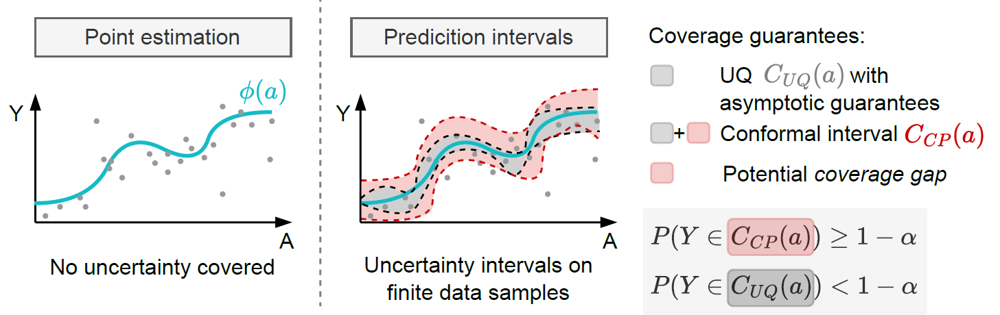

# Conformal prediction for causal effects of continuous treatments

### Abstract
Uncertainty quantification of causal effects is crucial for safety-critical applications such as personalized medicine. A powerful approach for this is conformal prediction, which has several practical benefits due to model-agnostic finite-sample guarantees. Yet, existing methods for conformal prediction of causal effects are limited to binary/discrete treatments and make highly restrictive assumptions such as known propensity scores. In this work, we provide a novel conformal prediction method for potential outcomes of continuous treatments. We account for the additional uncertainty introduced through propensity estimation so that our conformal prediction intervals are valid even if the propensity score is unknown. Our contributions are three-fold: (1) We derive finite-sample prediction intervals for potential outcomes of continuous treatments. (2) We provide an algorithm for calculating the derived intervals. (3) We demonstrate the effectiveness of the conformal prediction intervals in experiments on synthetic and real-world datasets. To the best of our knowledge, we are the first to propose conformal prediction for continuous treatments when the propensity score is unknown and must be estimated from data. 

<p align="center">

</p>


### Installations

The project is mainly built upon the following Python libraries:
1. [Pytorch-Lightning](https://pytorch-lightning.readthedocs.io/en/latest/) - deep learning models
2. [PYOMO](https://pyomo.readthedocs.io/en/stable/index.html) - non-convex optimization
3. [CVXPY](https://www.cvxpy.org/) - convex optimization


All neccessary libraries are statet in requirements.txt:
```console
pip3 install -r requirements.txt
```

The required solvers MOSEK and IPOPT need to be downloaded externally under a suitable license.


### Folder structure

Our python files are stored in the following folders:
1. modules: deep learning models, config_files, helper functions, implementation of our CP method
2. run: scripts for creating datasets, training models, creating prediction intervals, and plotting the results
3. data: created and preprocessed datasets

When running the scripts, results will be stored in the folder "results".

### Datasets
The datasets are generated/preprocessed when running the files:
- Synthetic simulator: `run/ceate_data.py`
- MIMIC III dataset: `run/data_preprocessing.py`

Before running MIMIC III experiments, place MIMIC-III-extract dataset ([all_hourly_data.h5](https://github.com/MLforHealth/MIMIC_Extract)) to `data/MIMIC/`


### Citation

If you use our code, please cite the corresponding paper '[Conformal Prediction for Causal Effects of Continuous Treatments](https://arxiv.org/abs/2407.03094)' as

Maresa Schröder, Dennis Frauen, Jonas Schweisthal, Konstantin Heß, Valentyn Melnychuk and Stefan Feuerriegel (2024). *Conformal Prediction for Causal Effects of Continuous Treatments*. arXiv preprint arXiv:2407.03094.